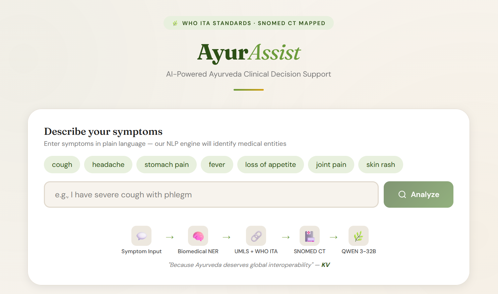

# AyurAssist

AI-powered clinical decision support that bridges modern medical terminology (SNOMED CT, UMLS) with traditional Ayurvedic knowledge using the WHO International Terminologies for Ayurveda (ITA).



## Architecture

AyurAssist runs on [Modal](https://modal.com) as a CPU-only serverless system. A terminology bridge (NER + UMLS + WHO-ITA) provides Ayurvedic vocabulary context to Qwen3-32B (via Groq API), which performs clinical reasoning across 13 structured assessment categories.

```
Browser (static site on GitHub Pages)
  |
  |─ GET /warmup ──> [CPU Container] ──> {"status": "ready"}
  |
  |─ POST / ──────> [CPU Container: ASGI + NER + UMLS + ITA + Groq]
                      |
                      ├─ 1. Input cleaning (strip conversational filler)
                      ├─ 2. NER extraction (scispacy en_core_sci_lg)
                      ├─ 3. Terminology bridge: NER → UMLS → ITA fuzzy matching
                      ├─ 4. UMLS lookup (CUI, SNOMED, ICD-10)
                      ├─ 5. Three-pass diagnosis via Groq (sequential):
                      │     Pass 1: Modern medical diagnosis
                      │     Pass 2: Ayurvedic diagnosis (+ ITA vocab + few-shot)
                      │     Pass 3: Ayurvedic treatment (+ ITA vocab + few-shot)
                      ├─ 6. 13 detail questions via Groq (parallel, semaphore=5)
                      └─ 7. Assemble JSON response with codes + treatment
```

### Terminology Bridge

The bridge provides **context** to the LLM, not the diagnosis itself:

- **Biomedical NER** -- [scispacy](https://allenai.github.io/scispacy/) `en_core_sci_lg` extracts medical entities with stopword filtering to reduce noise.
- **UMLS mapping** -- Two-step API lookup: keyword → CUI, then CUI atoms → SNOMED CT + ICD-10 codes.
- **WHO-ITA vocabulary** -- 3,550 Ayurvedic terms from `who-ita/ita_terms_ascii.csv` matched via fuzzy English matching (threshold 0.80). Matched terms are injected into LLM prompts as a constrained vocabulary dictionary.

### LLM (Qwen3-32B via Groq)

Three sequential diagnostic passes followed by 13 parallel detail questions:

1. **Modern diagnosis** -- NER entities + patient narrative → modern condition names
2. **Ayurvedic diagnosis** -- Modern diagnosis + ITA vocabulary + few-shot examples → Sanskrit condition names
3. **Ayurvedic treatment** -- Ayurvedic diagnosis + ITA vocabulary + few-shot examples → treatment plan
4. **13 detail questions** -- Run in parallel (semaphore=5) covering dosha analysis, symptoms, single remedies, formulations, panchakarma, diet, yoga, prognosis, modern correlation, differential diagnosis, investigations, prevention, and psychotherapy

### Data Flow

```
Patient narrative
    → Clean input (strip conversational filler)
    → NER: scispacy extracts biomedical entities
    → Bridge: entities → UMLS preferred terms → ITA fuzzy match
    → UMLS: cleaned phrase → CUI, SNOMED, ICD-10
    → Groq: 3 sequential passes (modern dx → ayur dx → ayur tx)
    → Groq: 13 parallel detail questions with ITA context
    → Response: structured JSON with codes + 13 treatment sections
```

## Project Structure

```
AyurAssist/
├── main.py                        # Modal backend (CPU-only, Groq + ITA bridge)
├── config.py                      # All tuneable constants (no secrets)
├── who-ita/
│   └── ita_terms_ascii.csv        # 3,550 WHO-ITA Ayurvedic terms
├── ayurveda_snomed_mapping.csv    # 226 WHO ITA conditions → SNOMED (reference)
├── docs/                          # Frontend (GitHub Pages)
│   ├── index.html
│   ├── style.css
│   └── app.js
└── README.md
```

## Configuration

All tuneable constants are in `config.py`. Edit this file to change model names, timeouts, thresholds, etc.

### Modal Secrets

Secrets are **not** stored in code. They are managed through [Modal's secret manager](https://modal.com/docs/guide/secrets).
You need to create two secrets in your Modal dashboard:

| Modal secret name    | Required env vars | How to get it |
|----------------------|-------------------|---------------|
| `groq-secret`       | `GROQ_API_KEY`    | [Groq console](https://console.groq.com/keys) |
| `my-umls-secret`    | `UMLS_API_KEY`    | [UMLS license](https://uts.nlm.nih.gov/uts/signup-login) |

Create them with the Modal CLI:

```bash
modal secret create groq-secret GROQ_API_KEY=gsk_xxxxxxxxxxxxx
modal secret create my-umls-secret UMLS_API_KEY=xxxxxxxx-xxxx-xxxx-xxxx-xxxxxxxxxxxx
```

### Frontend

Update `API` in `docs/app.js` to match your Modal deployment URL:

```javascript
var API='https://<your-modal-username>--ayurparam-service-fastapi-app.modal.run';
```

## Deployment

### Prerequisites

- Python 3.11+
- [Modal CLI](https://modal.com/docs/guide/getting-started) installed and authenticated
- Modal secrets created (see above)
- A Groq API key with access to `qwen/qwen3-32b`

### Deploy to Modal

```bash
modal deploy main.py
```

This builds the CPU container image, deploys the ASGI web endpoint, and outputs your deployment URL.

### Local development

```bash
modal serve main.py
```

This runs the app locally with hot-reload. The terminal will show the temporary URL.

## API

### `GET /warmup`

Returns immediately to confirm the service is ready.

**Response:**
```json
{"status": "ready"}
```

### `POST /`

Analyzes a patient narrative and returns Ayurvedic treatment recommendations across 13 categories.

**Request:**
```json
{"text": "patient complains of severe headache and nausea"}
```

**Response:**
```json
{
  "input_text": "...",
  "clinical_entities": [{"word": "headache", "score": 1.0, "entity_group": "ENTITY"}],
  "umls_cui": "C0018681",
  "snomed_code": "25064002",
  "snomed_name": "Headache",
  "icd10_code": "R51",
  "csv_match": {"ita_id": "...", "ayurveda_term": "...", "sanskrit_iast": "...", "sanskrit": "...", "description": ""},
  "results": [{
    "ayurveda_term": "Shiroroga",
    "snomed_code": "25064002",
    "icd10_code": "R51",
    "treatment_info": {
      "condition_name": "Shiroroga",
      "sanskrit_name": "...",
      "disclaimer": "...",
      "ayurparam_responses": {
        "overview_dosha_causes": "...",
        "symptoms": "...",
        "single_drug_remedies": "...",
        "classical_formulations": "...",
        "panchakarma": "...",
        "diet_lifestyle": "...",
        "yoga": "...",
        "prognosis": "...",
        "modern_correlation_warnings": "...",
        "differential_diagnosis": "...",
        "investigations_labs": "...",
        "prevention_recurrence": "...",
        "psychotherapy_satvavajaya": "..."
      }
    }
  }]
}
```

## Cost

| Component | When running | When idle |
|-----------|-------------|-----------|
| CPU container | ~$0.04/hr | $0 (scales to zero after 5 min) |
| Groq API | Pay per token ([pricing](https://groq.com/pricing/)) | $0 |

No GPU costs — all LLM inference is handled by Groq's hosted API.

## Key Dependencies

| Package | Purpose |
|---------|---------|
| `scispacy` + `en_core_sci_lg` | Biomedical NER entity extraction |
| `groq` | Qwen3-32B API client |
| `modal` | Serverless CPU container |
| `fastapi` | ASGI web framework |
| `requests` | UMLS API calls |

## Experiments

Validation experiments are on the [`experiments`](../../tree/experiments) branch:

- **[BhashaBench-Ayur (BBA)](../../tree/experiments/bba)** -- Ayurvedic medical knowledge benchmark with 9,348 English and 5,615 Hindi multiple-choice questions. AyurParam-2.9B scores 40.0% overall (best in the <3B class), while Qwen3-32B achieves 54.2% (best overall across all model sizes).
- **[Ablation Study](../../tree/experiments/ablation)** -- Compares three pipeline configurations (direct LLM, full pipeline with ITA bridge, bridge-only) across 80 gold-standard clinical vignettes. The full pipeline achieves 80% diagnosis accuracy vs 75% for direct LLM.
- **[Inter-Rater Reliability](../../tree/experiments/irr)** -- IRR analysis of four clinicians (2 MDs, 2 Ayurveda practitioners) rating 80 patient narratives, with LLM-augmented annotation for missing labels.

## Citation

If you use AyurAssist in your research, please cite:

```bibtex
@inproceedings{kuruvikkattil2026ayurassist,
  title={AyurAssist: Bridging Ayurvedic and Biomedical Clinical Knowledge Through Terminology-Grounded LLM Reasoning},
  author={Kuruvikkattil, Aravind V. and Pradeep, Anagha and Kumar, Veena S. and Purkayastha, Saptarshi},
  year={2026}
}
```
